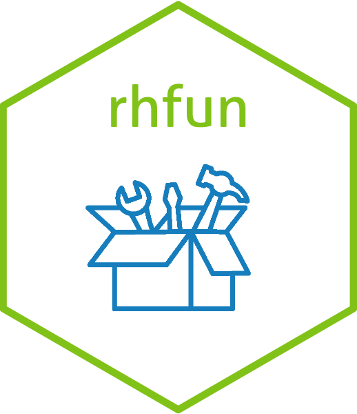

<!-- README.md is generated from README.Rmd. Please edit that file -->

# rhfun 

<!-- badges: start -->

[](https://github.com/maxbre/rhfun)
[](https://github.com/maxbre/rhfun)
[](https://lifecycle.r-lib.org/articles/stages.html#experimental)
[](https://www.repostatus.org/#wip)

<!-- badges: end -->

The new collection of my <span style="color: red">**R**</span>
<span style="color: red;">**h**</span>andy
<span style="color: red;">**fun**</span>ctions.

Utilities to automate repetitive tasks.

The reboot of an old package with some improvements(hopefully!).

Beware: all the material must be considered experimental, in full
development, not yet tested.

Caveat emptor: use it at your own risk.

## Installation

You can install the development version of ‘rhfun’ from
[GitHub](https://github.com/) with:

``` r
if(!require("pak")) install.packages("pak")
pak::pak("maxbre/rhfun")
```

or with:

``` r
if(!require("devtools")) install.packages("devtools")
devtools::install_github("maxbre/rhfun")
```
